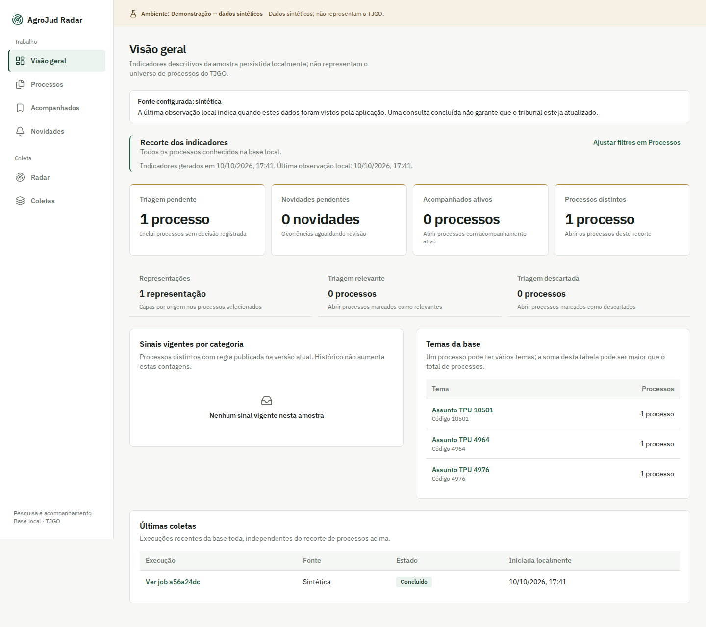
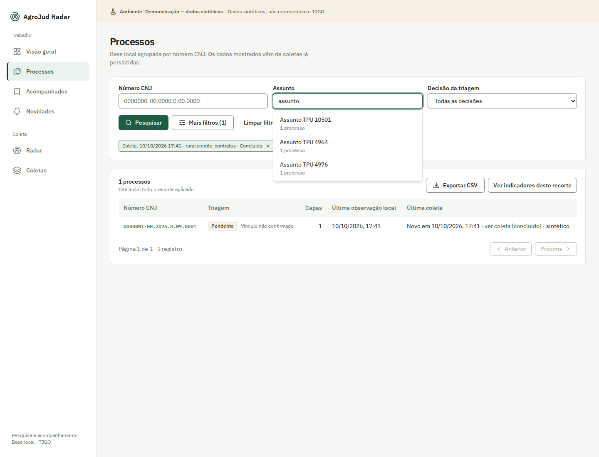
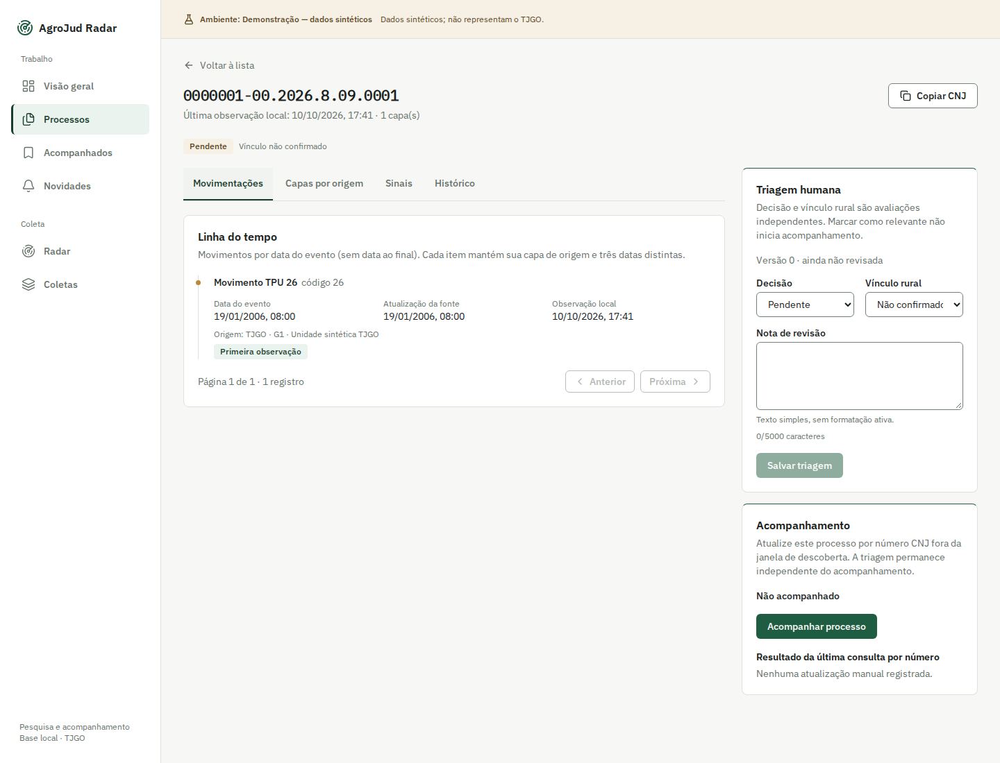
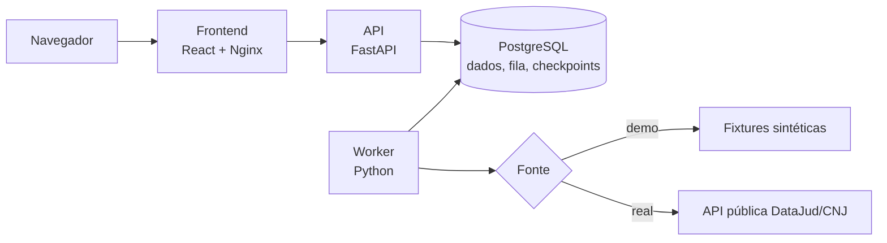

# AgroJud Radar

**Monitor local de contencioso do produtor rural.** O AgroJud Radar descobre, consulta, tria e acompanha processos judiciais públicos potencialmente relacionados ao agronegócio. O foco inicial é o TJGO, a partir de metadados e movimentações da API pública DataJud/CNJ.

O sistema organiza evidências para revisão humana. Ele não substitui a consulta ao tribunal nem a análise jurídica.

`React` · `TypeScript` · `FastAPI` · `PostgreSQL` · `Docker Compose`

[Telas](#telas) · [Arquitetura](#arquitetura) · [Demo e real](#demonstração-e-ambiente-real) · [Executar a demo](#executar-a-demonstração) · [Configurar com IA](#configurar-o-ambiente-real-com-uma-ia) · [Como usar](#como-usar) · [Limitações](#limitações) · [Documentação](#documentação)



<sub>Captura de uma execução local com fixtures sintéticas. Os dados exibidos não representam processos reais nem a cobertura do TJGO.</sub>

## O que o sistema faz

**Coleta**
- Executa consultas assíncronas com fila persistida, progresso, checkpoints e recuperação de falhas.

**Consolidação**
- Agrupa resultados por número CNJ, preserva as representações de cada origem e exibe movimentações com datas e procedência.

**Revisão humana**
- Oferece triagem com histórico, acompanhamento, novidades, sinais estruturados, indicadores locais e exportação CSV.

## Telas

Todas as capturas usam fixtures sintéticas do ambiente de demonstração.

| Processos e sugestões de filtro | Detalhe e movimentações |
| --- | --- |
|  |  |
| Lista de processos com autocompletar nos filtros. | Timeline de movimentações e painel de triagem humana. |

## Arquitetura

API e worker são processos separados do mesmo backend. O PostgreSQL atende tanto a persistência quanto a fila de jobs, sem infraestrutura adicional.



| Parte | Responsabilidade |
| --- | --- |
| Interface | React, TypeScript e Vite; servida por Nginx no Compose. |
| API | FastAPI e Pydantic; o contrato OpenAPI gera os tipos do frontend. |
| Worker | Processo Python separado que consome jobs persistidos. |
| Persistência | PostgreSQL para processos, decisões humanas, fila, leases e checkpoints. |
| Fontes | Fixtures determinísticas em `demo`; integração DataJud separada em `real`, sem fallback entre fontes. |

Decisões que orientam o backend:

- Chamadas HTTP externas acontecem fora de transações; página e checkpoint são gravados atomicamente sob posse válida do job.
- Leituras não escrevem, e a ingestão preserva decisões humanas já registradas.
- Falha da fonte é tratada como erro, nunca como resultado vazio.

## Demonstração e ambiente real

Os dois ambientes rodam o mesmo código, mas são isolados por projeto Compose, banco e arquivo de configuração. Não há fallback entre eles: se a fonte real falhar, o sistema não troca para dados sintéticos.

| | Demonstração | Ambiente real |
| --- | --- | --- |
| Finalidade | Conhecer a interface sem credenciais | Consultar processos reais do TJGO |
| Fonte de dados | Fixtures sintéticas determinísticas | API pública DataJud/CNJ |
| Configuração | `.env.demo` (a partir de `.env.demo.example`) | `.env.real` (a partir de `.env.real.example`) |
| Credenciais | Nenhuma externa | Chave DataJud e senha própria do banco |
| Pré-condição | Docker Engine e Docker Compose | Docker, Compose e aceite dos [termos do CNJ](https://datajud-wiki.cnj.jus.br/api-publica/termo-uso/) |

## Executar a demonstração

Requer Docker Engine e Docker Compose. O Compose constrói os serviços, então não é necessário instalar Python ou Node.js no host.

```sh
if [ ! -f .env.demo ]; then cp .env.demo.example .env.demo; fi

compose() {
  docker compose --project-name agrojud-demo --env-file .env.demo -f compose.yaml "$@"
}

compose up --detach --wait db
compose run --rm --no-deps api uv run --no-sync alembic upgrade head
compose --profile worker up --build --detach --wait api frontend worker
```

| Serviço | Endereço padrão |
| --- | --- |
| Interface | <http://127.0.0.1:5173> |
| API | <http://127.0.0.1:8000> |
| Documentação interativa da API | <http://127.0.0.1:8000/api/v1/docs> |

Se as portas estiverem ocupadas, ajuste `FRONTEND_PORT` e `API_PORT` em `.env.demo`.

Para parar os serviços sem remover o banco persistente:

```sh
docker compose --project-name agrojud-demo --env-file .env.demo -f compose.yaml --profile worker stop
```

## Configurar o ambiente real com uma IA

O prompt abaixo pode ser colado em uma IA de programação com acesso ao terminal. Ela clona o repositório, lê a documentação do próprio projeto para descobrir como o ambiente real é configurado e deixa o sistema pronto para uso.

Antes de usar, considere:

- **A IA não instala software.** Se faltar Git, Docker, Docker Compose ou outra ferramenta exigida, ela informa o que falta e você mesmo instala.
- **O uso da API DataJud depende dos termos do CNJ.** A IA resume os termos e pede sua confirmação; ela não aceita em seu nome.
- **Segredos ficam locais.** Senha do banco e chave da API são gravadas apenas na configuração do backend e não devem aparecer na conversa.

```text
Clone e configure o AgroJud Radar no ambiente real para eu usar. Execute o trabalho você mesmo; não fique só me dando instruções.

Repositório: https://github.com/Duarte0/AgroJud.git

Regras:
- Não instale, baixe ou atualize programas no computador e não peça senha de administrador. Se faltar algum pré-requisito, diga o que falta e o link oficial de instalação, espere eu instalar e continue de onde parou.
- Use somente o ambiente real. Nunca use a demonstração, fixtures ou dados sintéticos como substituto.
- Nunca mostre senhas, chaves ou o conteúdo do arquivo de configuração real, nem grave segredos em arquivos versionados.
- Preserve dados e alterações existentes: não sobrescreva arquivos, não apague volumes ou bancos e não faça reset. Se algo exigir isso, pare e me pergunte.
- Não esconda falhas. Se uma etapa falhar, explique o erro e o que você tentou.

Passos:
1. Se o diretório atual já for um clone deste repositório, use-o. Caso contrário, clone em uma pasta nova.
2. Antes de executar qualquer coisa, leia README.md, AGENTS.md, a documentação de operação em docs/, o exemplo de configuração do ambiente real, o compose.yaml e os scripts em scripts/. Descubra a partir deles os pré-requisitos, os comandos, as portas e o procedimento atual para o ambiente real. Não presuma comandos que o repositório não documenta.
3. Verifique se os pré-requisitos encontrados estão disponíveis.
4. Crie a configuração do ambiente real a partir do exemplo, se ainda não existir. Garanta que ela seja ignorada pelo Git e acessível só ao meu usuário. Gere uma senha forte para o banco sem exibi-la. Se já existir um banco real com credenciais diferentes, pare e me avise.
5. Se a chave DataJud não estiver configurada, obtenha a chave pública vigente na página oficial https://datajud-wiki.cnj.jus.br/api-publica/acesso/. Se não conseguir, peça para eu inseri-la diretamente no arquivo.
6. Leia os termos em https://datajud-wiki.cnj.jus.br/api-publica/termo-uso/, resuma para mim os limites de uso, incluindo a finalidade não comercial, e peça minha confirmação explícita. Sem ela, não ative nada que consulte o DataJud.
7. Aplique as migrations e suba os serviços seguindo o procedimento documentado no repositório. Se já existir um banco real, faça antes um backup com a ferramenta do repositório, fora da pasta do projeto. Se portas estiverem ocupadas, ajuste a configuração de forma consistente. Ative o worker somente depois do meu aceite. Não crie consultas nem faça chamadas de teste ao DataJud.
8. Confira os endpoints de saúde da API e a interface. Ao final, informe as URLs, o estado dos serviços e o comando para parar o ambiente sem perder dados.
```

## Como usar

Com o sistema aberto no navegador, o menu lateral se divide em **Coleta** (Radar e Coletas) e **Trabalho** (Visão geral, Processos, Acompanhados e Novidades). O uso típico segue este ciclo:

1. **Iniciar uma coleta no Radar.** Na aba *Nova coleta*, escolha um preset temático, a janela de ajuizamento (datas inicial e final) e o limite de registros da execução. Os mesmos critérios podem ser guardados em *Buscas salvas*, com atualização diária opcional às 06h.
2. **Acompanhar a execução em Coletas.** Cada coleta mostra status (na fila, em execução, aguardando nova tentativa, concluída, parcial, falhou ou cancelada), progresso confirmado, critérios efetivos e eventos. Coletas ativas se atualizam sozinhas; conforme o estado, é possível cancelar, retomar, continuar ou reiniciar a varredura.
3. **Explorar a base em Processos.** Os resultados persistidos aparecem agrupados por número CNJ. Filtre por número, assunto, tema, classe, órgão julgador, preset, coleta ou categoria de sinal; os campos sugerem valores já existentes na base. O botão *Exportar CSV* exporta todo o recorte filtrado.
4. **Revisar um processo.** O detalhe reúne capas por origem, timeline de movimentações e sinais estruturados (por exemplo, leilão ou recuperação judicial; a regra de penhora fica desabilitada no ambiente real), com link para a movimentação que serviu de evidência. No painel de triagem, classifique o processo como pendente, relevante ou descartado e, se for o caso, confirme manualmente o vínculo rural (a confirmação exige nota). Cada decisão fica no histórico.
5. **Acompanhar processos de interesse.** Use *Acompanhar processo* no detalhe. A página *Acompanhados* lista esses processos, que são atualizados diariamente às 06h ou sob demanda.
6. **Revisar novidades.** A página *Novidades* mostra o que foi observado depois da referência local de cada processo acompanhado, separando a data original do evento da data em que ele foi observado. Filtre por situação e categoria e marque cada item como revisado.
7. **Consultar a Visão geral.** Os indicadores descrevem apenas a amostra salva localmente, sem medir risco jurídico nem o total de processos do TJGO.

As ações que consultam o DataJud (coletas, atualizações e acompanhamento diário) dependem do worker ativo e, no ambiente real, de chave configurada. Quando a fonte não está disponível, a interface informa o motivo em vez de exibir resultado vazio.

## Limitações

- **Uso local e individual.** O projeto opera localmente para um usuário e não tem autenticação.
- **Sem autorização de uso comercial.** O projeto não declara autorização para uso profissional ou comercial. O uso dos dados é regido pelas orientações de [acesso](https://datajud-wiki.cnj.jus.br/api-publica/acesso/) e pelos [termos vigentes do CNJ](https://datajud-wiki.cnj.jus.br/api-publica/termo-uso/).
- **Cobertura não garantida.** Uma coleta concluída descreve aquela consulta; não comprova cobertura integral nem atualização completa do tribunal.
- **Regra de penhora desabilitada no real.** As evidências técnicas e seus limites estão na [SPEC-020](specs/SPEC-020-operacao-e-aceite-integrado.md).
- **Configuração própria.** O modo real é separado da demonstração e exige configuração própria no backend.

## Documentação

| Documento | Conteúdo |
| --- | --- |
| [PRD](PRD.md) | Requisitos do produto |
| [Plano de implementação](IMPLEMENTATION_PLAN.md) | Fases e contratos de implementação |
| [Índice das SPECs](specs/README.md) | Especificações, dependências, status e evidências |
| [Operação e aceite integrado](docs/operacao-e-aceite-integrado.md) | Migrations, jobs, backup, testes e recuperação |
| [Frontend](frontend/README.md) | Detalhes do frontend e do contrato OpenAPI |
